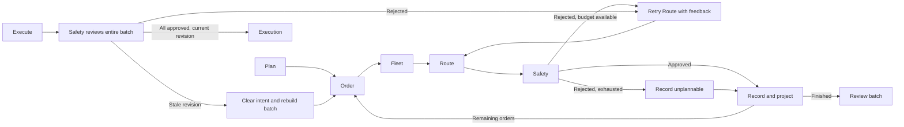

# Shared workflow state

The shared-state portion of Milestone B lives in `backend/app/graph/state.py`
and its deterministic partial-update helpers in `backend/app/graph/updates.py`.
`WarehouseGraphState` is a frozen Pydantic BaseModel with forbidden extra fields.
It imports the existing domain models; domain code does not import graph code.
All four standalone roles are implemented; graph wiring,
reducers, and checkpoint integration are not implemented. Shared model configuration lives outside graph state in
`backend/app/config.py`; no client is created at import time.

## Authority and ownership

`warehouse: WarehouseState` is the sole authoritative session snapshot.
`warehouse_revision` is a read-only Python property returning `warehouse.revision`;
it is not an independently accepted input or serialized field. Its nonnegative,
strict integer constraint comes from the existing warehouse model.
`DeliveryPlan.warehouse_revision` records the snapshot used to calculate a proposal.

| State field | Intended owner / meaning |
| --- | --- |
| `warehouse` | Trusted deterministic execution or domain actions publish a replacement snapshot |
| `command` | Command entry supplies `plan` or `execute`, independent of HTTP |
| `execution_requested` | Explicit execution intent; true requires an execute command |
| `order_selection` | Future Order role; ID and short explanation, checked against pending orders |
| `selected_robot_id` | Future Fleet role; identifier must exist in the snapshot |
| `delivery_plan` | Future Route role; existing two-leg `DeliveryPlan` |
| `planning_outcome` | Typed planning status: not_planned, planned, stale, unreachable, failed |
| `safety` | Future Safety role; existing `ValidationResult`, with None meaning unchecked |
| `replan_count` | Nonnegative strict integer; cannot exceed max_replans |
| `max_replans` | Session retry limit, default 3, allowed range 0–3; counts retries after initial planning |
| `run_outcome` | Typed idle/running/ready/delivered/no_work/no_robot/unreachable/failed result |
| `error_message` | Optional stripped explanation of 1–300 characters |
| `node_activity` | Ordered immutable tuple of typed node/status/optional-message records |

Order selections carry no invented priority score. Pending eligibility does not
imply reachability. Robot existence does not certify availability or battery.
There is no duplicate robot/order collection, completed-order count, or top-level
route_valid flag. Route validity exists only inside the nested safety result.

The schema validates references and numeric limits. The update helpers enforce
the invalidation contracts below. Direct schema construction does not certify a
`ready` outcome or enforce transitions. Constructing a safety
model is not evidence that deterministic validation ran; future Safety code must
publish actual validation output, and execution must independently revalidate.

## Serialization and future runtime integration

Use `model_dump_json()` and `WarehouseGraphState.model_validate_json(...)` for
JSON round trips. Existing warehouse serializers emit cell sets as sorted lists;
Pydantic reconstructs nested models, frozensets, and tuples on loading. Activity
tuple position preserves ordering without a timestamp or separate counter.
The activity collection uses a default factory; the schema stores no mutable lists.

Future tools receive the current snapshot from trusted node/runtime code. The LLM
must never supply authoritative warehouse_json. Future execution will construct a
temporary `WarehouseSimulation(snapshot)` and publish its successful final_state
as the replacement warehouse. Do not checkpoint that simulation or store the whole
DeliveryExecutionResult, which would duplicate its snapshot and validation result.
Clients and credentials likewise stay outside state.

JSON serialization, actual compiled-graph partial updates, and round trips through
the installed langgraph-checkpoint 4.2.0 JsonPlusSerializer are tested. Serializer
tests cover model objects and channel dictionaries for initial, approved, and
rejected states, with an explicit model-type allowlist and no pickle fallback.
This verifies serialization readiness, not MemorySaver integration. MemorySaver,
checkpoint retrieval, and session isolation/reset remain later-milestone work.
Milestone B's offline acceptance checks pass; the full suite has 250 passing tests.

## Partial updates and invalidation

Helpers return dictionaries containing only fields they own or deliberately
invalidate. They validate the complete merged candidate with `model_validate`,
then return those channels rather than the whole state. Explicit None clears a
channel; omitted keys preserve it. Existing states are never mutated. No reducers
are needed for these sequential replacement updates. Future nodes must use these
contracts rather than bypass them with unchecked `model_copy(update=...)` calls.

| Helper / owner | Outputs and invalidations |
| --- | --- |
| `select_order` / Order | Sets selection; clears robot, plan, safety, error, execution intent; resets planning, retries, and run outcome |
| `select_robot` / Fleet | Sets robot; preserves order; clears plan, safety, error, intent; resets planning, retries, and run outcome |
| `fresh_plan` / Route | Replaces plan, marks planned, clears safety/error/intent, marks running, resets replan_count to zero |
| `replan` / Route | Same proposal invalidation, but increments replan_count exactly once and rejects exhausted limits |
| `record_safety` / Safety | Sets deterministic findings and ready/failed outcome plus diagnostic; rejects findings that disagree with current validation |
| `replace_warehouse` / trusted domain caller | Replaces snapshot, clears safety/error/intent, marks idle; retains eligible selections and marks a retained plan stale |

Every helper preserves command, max_replans, and activity records. Selection
helpers invalidate even when explicitly selecting the same ID again. Warehouse
replacement clears selections/plans if their order is no longer pending or their
robot no longer exists. An identical snapshot returns an empty update.

Domain actions already increment revision. `replace_warehouse` requires a changed
snapshot to have exactly current revision + 1, and does not increment it again.
It accepts one domain action at a time, including atomic complete delivery; callers
must not batch several independently incremented snapshots into one update.

A retained stale plan keeps its original warehouse_revision. The derived
`is_plan_approved` helper requires matching selections, a matching current revision,
positive conflict-free safety, and agreement with current deterministic validation.
There is no additional stored approval field. New plans must match current
selections and revision. All new/retry proposals clear execution intent, so an
execute request cannot silently transfer permission to a replacement route.
Future execution must still require explicit intent and independently revalidate
immediately before committing; these helpers perform no movement.

Retries publish a supplied proposal and increment their own counter; fresh plans
reset it. Deciding whether new feedback is actionable, invoking A*, terminating
unreachable attempts, and conditional retry dispatch belong to future workflow
work. The test-only straight-line StateGraph verifies actual channel merging;
it introduces no production workflow, conditional edges, or checkpointer.

## Shared LLM configuration

`app.config` owns frozen `LLMSettings`, `load_settings`, and
`create_model_client`. Groq is the only provider. The factory constructs one
`langchain_groq.ChatGroq`; API lifespan injects it into SessionCoordinator,
which passes it to the graph and agents. No node constructs a client.
Injected offline clients bypass settings and provider imports unchanged.

| Variable | Meaning |
| --- | --- |
| `GROQ_MODEL` | Required nonblank Groq model ID; no default; must support tool calling |
| `GROQ_API_KEY` | Required secret; excluded from settings dumps and repr |
| `LLM_TIMEOUT_SECONDS` | Positive timeout up to 300 seconds; default 30 |
| `LLM_MAX_RETRIES` | Request retries, 0?5; default 2 |

`load_settings()` reads the process environment. Explicit
`load_settings(env_file=".env")` also reads a dotenv file, with process values
taking precedence. It does not mutate the environment or interpolate variables.
Missing explicit files raise an error. Incomplete settings permit offline
injection; live construction checks the model and key before importing ChatGroq.
Only placeholder values belong in `.env.example`; `.env` stays ignored.

`langchain-groq` is included in backend requirements.
[ChatGroq documentation](https://docs.langchain.com/oss/python/integrations/chat/groq)
describes the integration. Structured output explicitly uses `function_calling`
and the Pydantic schema, returning a validated model. This requires a Groq model
with tool calling, without requiring model-specific native JSON schema support.
`scripts/test_groq_api.py` uses this same factory and OrderSelection wrapper for
one live request. Live account access is verified separately from offline tests.

## Milestone C: Order Agent only

`graph/agents.py` exposes `order_agent(state, client=shared_client, tools=...)`.
The caller injects the shared client; the agent never creates a provider client.
`graph/tools.py` exposes only `OrderTools.pending_orders` and `order_metadata`,
which inspect the supplied immutable snapshot and return existing Order records.
There are no robot, routing, validation, or mutation tools in this toolset.

Tool invocation is explicit: the agent looks up pending orders in creation order,
reads their metadata, and supplies those results as model context. No model tool
dispatch loop exists and the model cannot provide warehouse_json. The prompt
prefers creation order, but eligibility (not model compliance with that preference)
is enforced in code; any returned pending ID is valid. No numeric priority exists.

`app.config.structured_output` wraps the injected client using
`with_structured_output(OrderSelection, method="function_calling")`. This requests
Groq tool-based structured output with the Pydantic class. The agent revalidates
the result with Pydantic, then checks membership in pending IDs from the actual
snapshot. The existing state validator provides an additional eligibility check.
Shape validation alone cannot authorize a nonexistent or non-pending ID.

`updates.order_result` uses `select_order` for success and the same existing
proposal-clearing helper for no-work/failure. All outcomes clear the previous
robot, plan, safety, execution intent, and retry count. Success writes one
OrderSelection and `running`; empty pending orders skip the model and write
`no_work`; invalid output or an ordinary tool/model error writes `failed` with a
short sanitized error. One Order activity record is appended. Warehouse, revision,
command, and max_replans are never updated by this agent.

Provider timeout configuration remains in the shared client. The agent handles
raised TimeoutError explicitly and other provider exceptions as generic failures;
it does not add a background timeout thread or retry loop. Process interrupts
are not swallowed. Tests use a fake chat model implementing the structured-output
boundary with real Pydantic JSON parsing, plus injected failure runnables. No
credentials or API calls are needed for these tests.

The Order-only increment added 21 tests. Production graph wiring remains unimplemented.

## Milestone C: Fleet Agent

`fleet_agent(state, client=None, tools=None)` reads the authoritative warehouse and
existing order selection. Its separate `FleetTools` exposes robot status lookup,
two-leg Manhattan lower bound, and deterministic candidate evaluation. Evaluation
calls the existing `plan_delivery` A* implementation; temporary plans are discarded,
not published as a Route proposal. Candidate results include a typed exclusion
reason, battery, lower bound, and actual steps when reachable.

Eligibility requires a pending selected order, an idle empty robot, two reachable
route legs, and battery at least equal to actual combined A* steps. Other robots
remain obstacles through the existing planner. Manhattan is diagnostic only:
detours can cost more. Exactly sufficient battery passes; zero battery can pass
an entirely zero-step delivery. Busy, charging, offline, unreachable, and
insufficient-battery candidates are excluded.

Without a client, Fleet chooses minimum `(total_steps, robot_id)`, using lexical
identifier order for equal costs regardless of warehouse tuple ordering. Optional
model assistance receives only verified eligible candidate records through the
shared structured-output adapter. Its `FleetSelection(robot_id, explanation)` is
parsed by Pydantic and checked for both candidate membership and compliance with
the same deterministic policy. Invalid, malformed, or out-of-policy choices fail;
they are not silently replaced. The model cannot set cost, route, or safety fields.
Activity records use the deterministic selection reason rather than generated claims.

Per the Fleet-specific authorization, every empty eligible set produces `no_robot`,
including the all-unreachable case. Exclusion categories remain visible in activity
diagnostics. This refines the earlier proposal to emit unreachable from Fleet;
future Route planning can still produce the separate unreachable outcome.
No model call occurs for an empty candidate set. Missing order selection, ordinary
tool/model exceptions, and timeouts return `failed` with sanitized diagnostics.

`fleet_result` delegates successful selection to the existing `select_robot` helper
and shares its proposal-clearing behavior for failure/no_robot. The exact partial
update contains selected_robot_id, delivery_plan, safety, planning_outcome,
error_message, execution_requested, run_outcome, replan_count, and node_activity.
Plan/safety become None, planning becomes not_planned, execution intent becomes
false, and retries reset to zero. Success sets running, an empty candidate set sets
no_robot, and failures set failed. One Fleet activity record is appended.
Order selection, warehouse/revision, command, and max_replans are preserved.

The full suite has 307 passing offline tests, including 36 Fleet cases with actual
A* detours and injected structured-model/tool failures. No provider installation
or live credentials were needed. Safety was added in the subsequent increment below.

## Milestone C: Route Agent

`route_agent(state, tools=None)` performs one fresh planning attempt from the
authoritative warehouse, selected order ID, and selected robot ID. `RouteTools`
exposes only `build_delivery_plan(snapshot, order_id, robot_id)`, which delegates
directly to Milestone A's `plan_delivery` and returns its DeliveryPlan or None.
The existing planner calls A* for robot-to-pickup and pickup-to-drop-off, retaining
endpoints, total movement cost, and the current warehouse revision. There is no
duplicated pathfinding, model client, generated-coordinate input, or safety approval.

`route_result` uses the existing `fresh_plan` helper on success. Its partial update
contains delivery_plan, planning_outcome, safety, replan_count, error_message,
execution_requested, run_outcome, and node_activity. Fresh attempts reset retries
to zero, clear safety/errors/execution intent, and append one Route activity.
Success sets planning_outcome=planned and run_outcome=running; Safety has not run.
An unreachable leg sets both outcomes to unreachable and clears the previous plan.
Missing selections, invalid tool return types, and ordinary tool errors set failed
with a sanitized diagnostic and no plan. Neither selections nor warehouse change.

This entry point is explicitly fresh planning; future retry orchestration must
use the separate replan contract rather than calling this reset path as a retry.
No retry loop or conditional dispatch is implemented. Runtime tool injection is
trusted application/test code, not a model-facing extension point.

The full suite has 324 passing tests, including 17 Route cases covering zero-step
legs, obstacles represented by blocked cells, other robot occupancy, unreachable
endpoints, revision retention, exact domain-plan equality, failure handling, and
owned-field invalidation. Existing domain tests cover permanent shelf obstacles.
Tests use no credentials or live calls. Safety was added in the subsequent increment below.

## Milestone C: Safety Agent

`safety_agent(state, tools=None, client=None)` checks the current DeliveryPlan,
snapshot/revision, and selected order/robot. Retry counts and limits are preserved;
Safety does not schedule retries or execute movement. Its separate `SafetyTools`
exposes `check_delivery_plan`, delegating directly to Milestone A validation. That
function calls route validation for both legs, checks occupied robot cells and
conflicts, battery, lifecycle/status, endpoints, bounds, obstacles, and revision.
There is no second implementation of these rules.

`safety_result` uses `record_safety`, which independently compares the tool output
with deterministic validation before accepting it. The authoritative field is
`safety: ValidationResult`; route_valid and collision_risk remain nested, with all
reasons and conflicts retained. Missing validation or a tool failure clears prior
safety to None (unchecked), sets failed, and revokes execution intent. Missing or
mismatched selections fail safely. Malformed plan schemas additionally discard
the malformed proposal and mark planning failed; valid schemas with invalid route
geometry retain the plan and publish deterministic rejection findings.

Success writes safety, run_outcome=ready, error_message=None, and one activity
record. Rejection sets failed and clears execution_requested. No warehouse,
selection, retry, or command fields change. Ready is not movement permission:
later execution must still require intent and independently revalidate.

An optional injected client may produce `SafetyExplanation(explanation)` only,
after deterministic validation. Its text appears solely in an activity message
explicitly labeled non-authoritative. Even contradictory text cannot change
findings or flags. Model error/timeout/malformed summary preserves actual findings
but sets failed and revokes execution intent. Without a client no model call occurs.

The suite now has 347 passing offline tests, including 23 Safety cases. Coverage
includes safe plans, blocked/occupied cells, stale revision, battery/status,
malformed or missing plans, missing/mismatched selections, fabricated tool approval,
tool failures, contradictory fake-model summaries, and model failures/timeouts.
No Safety workflow edges, MemorySaver integration, API, or frontend were added.

## Milestone D: command workflow

`graph/graph.py:build_graph` compiles a sequential `WarehouseGraphState` graph,
with one injected model client and the existing role tools. Fleet and Safety
remain deterministic by default; optional model assistance reuses that client.
The original Milestone D graph had no checkpointer or session storage. Milestone E
below adds optional checkpointing and a coordinator; API and frontend remain future work.

Nodes are dispatch, order, fleet, route, retry_route, safety, execution, and failure.
Dispatch establishes execution intent only for an explicit execute command and
clears previous safety. Its entry schema permits malformed proposal data solely
to return failed with that proposal discarded; subsequent nodes use strict state.
Other invalid domain/state input remains subject to Pydantic validation.

PLAN follows Order -> Fleet -> Route -> Safety. Conditional edges terminate on
no_work, no_robot, unreachable, or role failure. A safe proposal ends ready without
movement. EXECUTE starts at Safety, revalidating the supplied proposal against the
supplied authoritative snapshot. Missing proposals fail. Without the Milestone E
coordinator, the caller passes the full current input to each invocation.

Safety's typed activity status distinguishes deterministic rejection from an
operational failure. Model/tool failure is terminal, even if deterministic findings
are also present. Branch selectors do not parse diagnostic text. A rejection is
replannable only with a newer warehouse revision and routing-related findings
(stale_plan, blocked, obstacle, wrong_start, or occupied-cell conflicts). Invalid
geometry, unavailable robots, insufficient battery, and other terminal findings
do not enter the retry loop. A revision-only change permits one conservative refresh.

The current authoritative snapshot carries every A* constraint. The existing
planner already includes blocked cells and other robots' positions; no parallel
obstacle list exists. Once a plan uses the current revision, another rejection
cannot cause a same-snapshot retry. Unreachable is immediately terminal.

The retry adapter calls the existing Route Agent but adapts its partial update
before publication. Initial planning sets replan_count=0. Every admitted retry
consumes exactly one attempt, including unreachable and tool-failure outcomes;
fresh-plan behavior cannot reset the count. max_replans=3 permits three retries,
with no fourth attempt. Successful retry publication reuses the existing replan
helper and clears safety and execution intent before the next validation.

Execution independently requires execute command, explicit intent, ready outcome,
matching plan/selection IDs, present conflict-free deterministic approval, and
matching revisions. `is_plan_approved` revalidates the stored findings. A temporary
WarehouseSimulation then uses existing atomic execute_delivery, which validates
again. Success publishes through replace_warehouse with exactly one revision
increment, clears obsolete proposal/selection/safety, and reports delivered.
Failure publishes diagnostics without changing the warehouse.

None safety cannot authorize the execution node. At workflow entry, EXECUTE runs
Safety first, so an unchecked proposal can only execute after fresh approval.
Every replacement proposal clears execution intent and ends ready for review,
even when its coordinates happen to match the old proposal. Only a new explicit
execute invocation restores intent. Reinvoking an execute input is a new command.

Activity examples (history is retained across invocations):
- Normal PLAN: order, fleet, route, safety.
- PLAN with one changed-snapshot retry: order, fleet, route, safety (rejected),
  route, safety (completed).
- EXECUTE appends: safety, execution.

Compiled-workflow tests use fake models and real A*/validation/execution. Test-only
wrappers publish domain-generated snapshot changes between nodes to exercise
recovery; production PLAN nodes never mutate warehouse state. Tests cover early
termination, exact retry budgets, consumed failed attempts, changed occupancy/start
positions, review-only replacement, independent execution guards, malformed plans,
operational failures, and atomic publication/rollback.

## Milestone E: process-local sessions

`app/sessions.py` provides one synchronous `SessionCoordinator(client=...)`, one
`InMemorySaver` (also called MemorySaver), and one existing graph compiled with
that saver. `build_graph(..., checkpointer=None)` still supports uncheckpointed
use. No nodes or conditional edges were duplicated or changed.

Each new session uses a UUID string directly as LangGraph `thread_id`. The private
registry contains only a lock and a committed `RunnableConfig` reference per ID,
including `thread_id`, `checkpoint_ns`, and `checkpoint_id`. It holds no warehouse
copy and no persistent simulation. `WarehouseGraphState` in the committed
checkpoint is the sole authoritative session state. Domain mutations and atomic
execution construct temporary simulations.

Public interface:

| Method | Return |
| --- | --- |
| `create_session()` | `SessionCreated(session_id, state)` |
| `get_state(session_id)` | Validated committed `WarehouseGraphState` |
| `plan(session_id)` | Committed workflow state |
| `execute(session_id)` | Committed workflow state |
| `create_order(session_id, order_id, package_id, pickup, dropoff)` | Committed updated state |
| `add_blocked_cell(session_id, position)` | Committed updated state |
| `remove_blocked_cell(session_id, position)` | Committed updated state |
| `reset(session_id)` | `SessionCreated` with a fresh ID/state |

Positions use the existing `Position` model. Typed service errors are
`UnknownSession`, `SessionBusy`, `InvalidMutation`, and `SessionExecutionError`,
all under `SessionError`. There is no public state replacement, plan injection,
safety override, checkpoint selection, or historical replay interface.

Initialization and direct mutations publish all graph-state channels with public
`update_state(..., as_node="execution")`. This attribution does not call execution;
its unconditional END edge ensures the checkpoint schedules no work. Publication
retrieves the returned checkpoint, validates with `WarehouseGraphState.model_validate`,
and checks state equality and absence of scheduled work before advancing the
committed reference. Mutations reuse domain operations and `replace_warehouse`,
including their revision increments, no-op behavior, and stale-approval invalidation.

PLAN and EXECUTE retrieve the exact committed checkpoint and submit its complete
state, with the new command, to `invoke` using that checkpoint's config. They never
resume with `None` or start from an unqualified latest checkpoint. Invocation uses
synchronous checkpoint durability. Only after it finishes does the coordinator
retrieve the thread's resulting latest checkpoint, reconstruct the state, check
that execution finished and no new node reported operational failure, and advance
the private committed reference. Same-thread exclusion makes this final latest
lookup unambiguous. Existing typed node failures also become `SessionExecutionError`;
expected domain outcomes such as no work/resources, unreachable routes, and
deterministic safety rejection remain workflow state results.

Intermediate checkpoints may exist after any failed command, including after a
delivery checkpoint was written but the operation raised. They are never exposed
by `get_state`: it always uses the exact committed config. Failed reads, writes,
reconstruction, model execution, or invocation leave that reference unchanged.
The next command forks from the committed config with fresh command input. This
also prevents pending work from a failed intermediate checkpoint being resumed.
Only simulated delivery is supported; there are no external physical side effects.

Every operation on an existing session, including reads and reset, acquires its
nonblocking lock and holds it through reconstruction and committed-reference
publication. Contention raises `SessionBusy`. `finally` releases the lock on both
success and failure. A small registry lock covers only lookup/guard acquisition
and registration/retirement; it is never held during graph/model/checkpoint work.
Other sessions can progress while one session is running.

Execution retains Milestone D's Safety revalidation, revision checks, atomic
delivery and review-only replacement proposals. Successful delivery consumes
selection/plan/safety. Duplicate EXECUTE originally raised `SessionExecutionError` for the
missing proposal and preserves the delivered commit, including robot positions,
battery, order completion, and unrelated pending orders.

Reset holds the old guard while creating and validating a fresh initial checkpoint
on a new UUID/thread. Only after this succeeds does registry bookkeeping register
the new session and retire the old ID. Old commands then raise `UnknownSession`.
Failed reset preserves the old session. No selections, routes, blocks, safety, or
diagnostics transfer. Old checkpoints can remain in memory but are inaccessible
through the coordinator and cannot affect the new thread.

The serializer reuses Milestone B's `JsonPlusSerializer` approach with an explicit
allowlist of workflow/domain records and enums and `pickle_fallback=False`.
All storage is process-local RAM: restarting or recreating the coordinator loses
session access. Checkpoint history can grow during its lifetime; this milestone
adds neither disk/database persistence nor a retention service.

Checkpoint retrieval example (with `backend` on the Python path and an injected
model client, which may be fake):

```python
from app.sessions import SessionCoordinator
from app.warehouse import Position

sessions = SessionCoordinator(client=client)
created = sessions.create_session()
sessions.create_order(created.session_id, "o", "p",
                      Position(x=2, y=0), Position(x=9, y=0))
planned = sessions.plan(created.session_id)
retrieved = sessions.get_state(created.session_id)
assert retrieved == planned  # Exact committed checkpoint, validated on retrieval.
```

The implementation follows public LangGraph APIs documented in
[checkpointer persistence](https://docs.langchain.com/oss/python/langgraph/persistence),
[checkpoint forking](https://docs.langchain.com/oss/python/langgraph/use-time-travel),
and [`update_state` attribution](https://reference.langchain.com/python/langgraph/pregel/main/Pregel/update_state).
It does not inspect saver storage internals.

Verification: 422 offline tests pass, including 39 session cases. Session tests
cover real intermediate checkpoints after interruption, failed final publication,
retry from the committed config, two-session warehouse isolation, actual threaded
busy rejection and independent progress, mutation invalidation, duplicate delivery,
reset isolation and failed-reset rollback. No live credentials are required.
At Milestone E completion, FastAPI remained future work. Milestone F below adds it;
React, deployment and persistent storage remain unimplemented.

## Milestone F: thin FastAPI service

`app/api/main.py` exposes `create_app(*, coordinator=None, allowed_origins=None)`
and the importable `app`. The API is a synchronous HTTP adapter over
`SessionCoordinator`, the sole application-facing behavior gateway. Handlers call
its public methods, never a simulation, graph node, saver, or private registry.
`app/api/sessions.py` only retrieves the application-owned coordinator from
`app.state`. Request/response definitions live in `app/api/schemas.py`.

Lifespan uses a supplied coordinator directly. Otherwise it calls the existing
model-client factory once and constructs one coordinator for the application's
lifetime. Importing the API creates no model client, performs no model invocation,
and loads no model credentials. Offline tests inject a real coordinator with fake
model clients. Default live startup requires the existing optional provider
integration and model environment settings; no automatic fake fallback exists.

### Endpoint and schema contract

| Method | Path | Coordinator method | Successful response |
| --- | --- | --- | --- |
| POST | `/api/sessions` | `create_session()` | 201 SessionResponse |
| GET | `/api/sessions/{session_id}/state` | `get_state(id)` | 200 SessionResponse |
| POST | `/api/sessions/{session_id}/orders` | `create_order(id, ...)` | 201 SessionResponse |
| POST | `/api/sessions/{session_id}/plan` | `plan(id)` | 200 CommandResponse |
| POST | `/api/sessions/{session_id}/execute` | `execute(id)` | 200 CommandResponse |
| POST | `/api/sessions/{session_id}/blocked-cells` | `add_blocked_cell(id, position)` | 200 SessionResponse |
| DELETE | `/api/sessions/{session_id}/blocked-cells/{x}/{y}` | `remove_blocked_cell(id, position)` | 200 SessionResponse |
| POST | `/api/sessions/{session_id}/reset` | `reset(id)` | 201 SessionResponse with new ID |

`CreateOrderRequest` contains `order_id: Identifier`, `package_id: Identifier`,
`pickup: Position`, and `dropoff: Position`. Example:

```json
{"order_id":"o","package_id":"p","pickup":{"x":2,"y":0},"dropoff":{"x":9,"y":0}}
```

Add-block uses the existing Position model directly: `{"x":5,"y":0}`. DELETE
parses integer path coordinates and constructs that same model. Strict coordinate
JSON fields reject strings, floats and booleans. Domain validation, including
bounds, occupied cells, duplicate IDs, and drop-off eligibility, stays in the
coordinator/domain layer. Every request model forbids extra fields. Session
creation, PLAN, EXECUTE and reset reject any nonempty HTTP body, including `{}`;
no arbitrary state, plan, safety approval or checkpoint reference can be supplied.
Order creation only creates pending work; it never triggers planning or execution.

`SessionResponse` contains `session_id: str` and `state: WarehouseGraphState`.
`CommandResponse` adds `outcome: RunOutcome` and optional `error: ApiError`.
`ApiError` has an enumerated stable code and sanitized message; `ErrorResponse`
wraps it in `error`. Existing nested domain models are reused. Revision is exposed
at `state.warehouse.revision`, not via a duplicate mutable revision field.

### Committed state and errors

For commands, `outcome` describes the attempt and `state` always describes the
authoritative committed checkpoint. A failed attempt can therefore return
`outcome="failed"` with `state.run_outcome="delivered"`. The API never changes a
committed state to match a rejected attempt or reads an intermediate checkpoint.

The only coordinator refinement is `SessionCommandRejected`, a specific subtype
of `SessionExecutionError` preserving compatibility for existing service callers.
Under the session guard, EXECUTE without a proposal raises this typed exception
before invoking the graph. It carries the prior committed state and code
`consumed_proposal` when that state's outcome is delivered, otherwise
`missing_proposal`. No diagnostic text is parsed and no checkpoint is published.
Its specific HTTP handler returns a 200 failed CommandResponse. Other recognized
deterministic terminal workflow rejections retain their existing committed failed
state and receive code `workflow_rejected`. Operational node/model failures and
unexpected graph/checkpoint failures remain internal failures.

| Condition | HTTP | Public code/result |
| --- | --- | --- |
| Request validation or forbidden body | 422 | `invalid_request` |
| InvalidMutation | 422 | `invalid_mutation` |
| UnknownSession, including retired ID | 404 | `unknown_session` |
| SessionBusy | 409 | `session_busy` |
| Missing/consumed proposal | 200 | Failed command with prior committed state |
| Ready, delivered, no_work, no_robot, unreachable, deterministic failed | 200 | Typed command outcome |
| SessionExecutionError or unexpected exception | 500 | `internal_error` |

Custom validation errors omit raw inputs, exception context, and request bodies.
Internal error responses contain a fixed safe message, no exception repr or stack
trace. A specific exception handler for SessionCommandRejected takes precedence
over its SessionExecutionError base handler. Failed checkpoint publication leaves
the coordinator commit unchanged, as in Milestone E.

### Example responses

These are shortened JSON excerpts from a fake-client TestClient demonstration;
the actual responses include the entire validated state, including all robots,
orders, obstacles, selection, routes, safety, and ordered activity records.

Create session (201):

```json
{
  "session_id": "1ba311a3-c6c8-40fb-9787-39e4327fb57a",
  "state": {
    "warehouse": {"revision": 0},
    "run_outcome": "idle",
    "delivery_plan": null,
    "safety": null,
    "node_activity": []
  }
}
```

PLAN after creating the example order (200):

```json
{
  "session_id": "1ba311a3-c6c8-40fb-9787-39e4327fb57a",
  "outcome": "ready",
  "error": null,
  "state": {
    "warehouse": {"revision": 1},
    "run_outcome": "ready",
    "execution_requested": false,
    "delivery_plan": {"order_id": "o", "robot_id": "robot-1", "total_steps": 9, "warehouse_revision": 1}
  }
}
```

Block `(5, 0)`, then EXECUTE (200, replacement ready):

```json
{
  "session_id": "1ba311a3-c6c8-40fb-9787-39e4327fb57a",
  "outcome": "ready",
  "error": null,
  "state": {
    "warehouse": {
      "revision": 2,
      "robots": [{"id": "robot-1", "position": {"x": 0, "y": 0}, "battery": 100}]
    },
    "run_outcome": "ready",
    "execution_requested": false,
    "delivery_plan": {"order_id": "o", "robot_id": "robot-1", "total_steps": 11, "warehouse_revision": 2}
  }
}
```

The robot has not moved or spent battery. A second explicit EXECUTE delivers it
at `(9, 0)` with battery 89 and revision 3. Another EXECUTE then returns:

```json
{
  "session_id": "1ba311a3-c6c8-40fb-9787-39e4327fb57a",
  "outcome": "failed",
  "error": {
    "code": "consumed_proposal",
    "message": "No delivery proposal is available; plan before executing"
  },
  "state": {
    "warehouse": {"revision": 3},
    "run_outcome": "delivered",
    "delivery_plan": null,
    "safety": null
  }
}
```

### Runtime and verification

Endpoints are synchronous and return after the complete coordinator operation.
`node_activity` is the actual ordered committed history, not a live event stream;
there are no WebSockets or streaming updates. CORS defaults to
`http://localhost:5173`, configurable via comma-separated `CORS_ALLOWED_ORIGINS`
or explicit factory origins. GET, POST, DELETE and Content-Type are permitted;
credentials are disabled. See [local startup](environment.md#milestone-f-api).

Nested models serialize through FastAPI: tuples become arrays, enums become
strings, unknown safety is null, and cell sets use the existing sorted serializer.
No clients, locks, checkpoint configs or environment secrets appear in responses
or OpenAPI. `/docs` and `/openapi.json` succeed, and schema tests verify all eight
operations and the absence of request bodies on command/session creation/reset.

Verification: 498 offline tests pass, including 76 API cases. Tests cover real
session/graph integration, actual busy contention with independent session reads,
stale route review, duplicate execution, reset, strict input rejection, checkpoint
and model failure preservation, and serialization. A subprocess import test forbids
client-factory calls during API import. A source boundary test excludes simulation,
graph runtime, saver and private coordinator access from the API package.

Fleet continues to report no_robot when its reachability checks exclude all
candidates. Route unreachable is tested by blocking pickup after planning, then
executing the stale proposal; the admitted retry terminates unreachable without
movement. Narrow service doubles cover HTTP-only failures and terminal failed
outcome mapping; normal flows use the real coordinator and fake models.

One installed Starlette/AnyIO deprecation warning remains; no tests failed and no
warnings were suppressed. Live provider calls were not performed. Sessions remain
process-local RAM only, lost on restart. No database, authentication, deployment,
React or Milestone G functionality was added.


## Sequential multi-order batch planning (current workflow)

This section supersedes the historical deterministic agent and single-proposal
milestones above. The authorized ALL-LLM migration retains batch planning,
LangGraph, checkpointing, SessionCoordinator, API endpoints, and simulation.

### Shared client and agent contracts

The application constructs one ChatGroq through `create_model_client()` and injects
it through SessionCoordinator and build_graph into all four roles. There are no
clients in shared state or individual nodes. Every decision uses
`structured_output(client, Schema)` with `method="function_calling"`, separate
SystemMessage/HumanMessage prompts, and Pydantic validation. Provider errors are
sanitized. Tools retrieve trusted warehouse records; they do not decide outcomes.

| Role | Structured response | Responsibility |
| --- | --- | --- |
| Order | OrderSelection | Select any remaining pending order and explain why |
| Fleet | FleetSelection | Choose a robot using all robot records and warehouse context; null reports no suitable robot |
| Route | LLMRoutePlan | Supply both complete coordinate sequences, or explicitly report unreachable |
| Safety | SafetyDecision | Approve/reject, with conflict strings and an explanation |

Basic checks reject invented IDs, unavailable robots, mismatched route IDs,
out-of-grid coordinates, empty route legs, and malformed responses. Route geometry
is preserved exactly as the model supplied it; total_steps is its edge count.
Fleet no longer computes minimum-cost assignments; Route does not call A* or
plan_delivery; Safety and update helpers do not call validate_delivery_plan.
Safety approval is the model's decision, not a deterministic safety certificate.

### State and batch projection

`planned_deliveries` is an immutable sequence of PlannedDelivery records containing
order_id, selection, robot_id, delivery_plan, SafetyDecision, status, and reason.
Statuses are approved, unplannable, stale, delivered, failed, and not_executed.
Schemas reject duplicate orders, mismatched identifiers, and approvals without a
plan and an approving SafetyDecision. The active single-order fields summarize
the first approved delivery on READY; the batch sequence controls execution.

`warehouse` is the committed real snapshot. `batch_revision` identifies its input
revision. Private projected_warehouse, planning_queue, and planning_index channels
support sequential planning and are cleared on completion. Each Order decision
chooses from the remaining pending IDs, so a model can change creation order.
Unplannable orders receive a reason and are not retried within that planning pass.

After model approval, projection assumes delivery success and derives the robot's
new position, battery, availability, order status, and next revision. It validates
WarehouseState data constraints, including nonnegative battery and valid occupancy.
It neither executes movement nor validates route geometry. These hypothetical
records inform the next Fleet/Route/Safety calls and never replace real warehouse
state during Plan. Operational/model/schema failures preserve the previous session
commit rather than publish an incomplete plan.

### Conditional flow and review



Safety rejection supplies the previous route and structured feedback to Route.
Each retry consumes the shared max_replans budget (0-3). Repeating the rejected
coordinates fails cleanly. Exhausted rejection records the order as unplannable;
other approved orders may still form a READY batch. If none are approved, the
command fails. Malformed output/provider failures do not retry through this edge.

Execute runs Safety on the sequential projection before any real delivery. A
revision mismatch remains an independent data-integrity guard even if the model
approves. Stale replacement rebuilds the batch. A non-stale Safety rejection keeps
the reviewed prefix, retries that route, and rebuilds the dependent suffix.
Both replacement paths clear execution intent and return proposals for review;
another explicit Execute is required. A fresh Plan resets the retry budget.

### Execution and checkpoint policy

WarehouseSimulation.execute_delivery still performs deterministic route validation,
checks battery, obstacles, adjacency, endpoints and occupancy, and atomically
applies each approved delivery. An incorrect LLM approval cannot bypass these
execution checks. The warehouse package, including its reusable A* implementation,
is unchanged; A* is not in the application's agent decision path.

Successful deliveries advance revision once each. A typed domain failure records
failed, stops the dependent suffix as not_executed, and retains the completed
prefix. The outcome is partial if any delivery completed, otherwise failed.
Consumed records cannot execute twice. A new Plan addresses remaining orders.
Unexpected execution or checkpoint exceptions preserve the prior committed state
for the whole command. Movement is simulated in memory with no external side effects.

SessionCoordinator retains one saver, per-session guards, private committed
checkpoint references, and serializer support for PlannedDelivery/SafetyDecision.
API endpoints and response envelopes are unchanged. The nested safety shape is now
`{approved, conflicts, explanation}`; the dashboard displays those fields, batch
assignments/results, and one selected route at a time. Robot positions always show
the committed warehouse, even when a later route starts from a projected position.

### Verification and limitations

Offline tests script all four model responses, including non-minimum Fleet choices,
model-authored detours, incorrect Safety approval, rejection feedback, bounded
retries, review-only replacement, partial execution, and checkpoint isolation.
The shared fake can generate canned responses using domain functions for existing
integration fixtures; these are test-only helpers, not production decisions.
ChatGroq function-call parsing is tested offline for all four Pydantic schemas.

Fleet request regression tests also intercept the real ChatGroq completion boundary
with fully scripted responses (no automatic routing/ranking fake). They verify two
separate Fleet calls, all three robots in each payload, projected position/battery,
cleared per-order fields, and both changed and repeated robot selections, with and
without session checkpointing. The `app.graph.batch` logger emits an INFO record
per Fleet decision with order ID, input revision, robot tuples
`(id, x, y, battery, status)`, selected ID, and outcome; it excludes prompts,
credentials, and provider errors. Enable INFO for this logger in the server's
logging configuration when investigating live choices.

Shared drop-offs can legitimately force repeated robot assignments: for orders
`(4,2) -> (9,0)` and `(1,4) -> (9,0)`, the first robot remains at `(9,0)` in the
projection. Another robot cannot deliver into that occupied cell. The occupant can
leave for the second pickup and return. A regression test verifies that projection
matches actual execution and that a different robot's attempted delivery is rejected.
Using multiple robots for this case would require an explicitly designed departure
or parking operation; resetting the projection or ignoring occupancy is not valid.

LLM routes may be invalid or suboptimal; Safety may approve incorrectly or reject
valid routes. Domain execution can therefore reject a model-approved batch.
Planning normally needs four Groq calls per considered delivery and Execute needs
another Safety call per approved delivery; retries add calls and latency. There
is no guaranteed optimal scheduling or route quality. Motion remains sequential,
with no automatic parking, charging, or concurrent time-expanded routing. The
10,000-step graph limit guards exceptionally large batches. Sessions remain
process-local and are lost on restart. No live Groq call is part of pytest.
